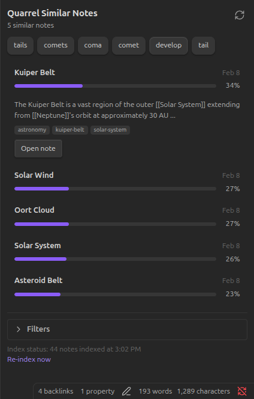
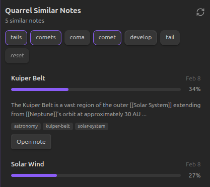
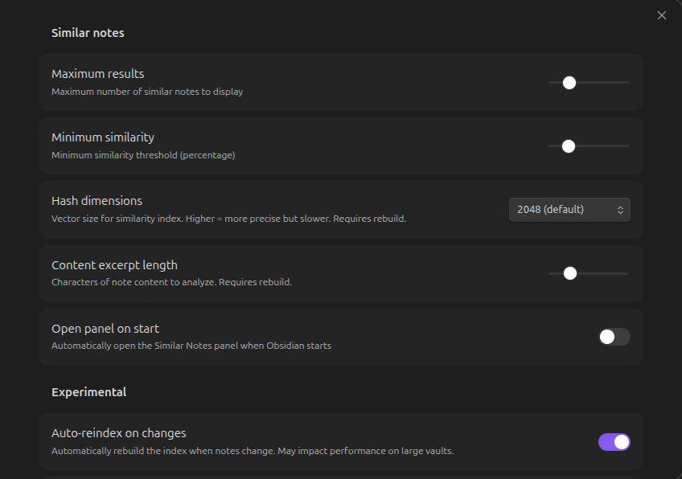

# Quarrel Similar Notes

An Obsidian plugin that surfaces semantically similar notes in a sidebar panel. Powered by TF-IDF + cosine similarity via [@watthem/quarrel](https://github.com/watthem/quarrel).

<!-- TODO:  -->

## Features

- **Local-first**: All processing happens on-device. No network calls, no API keys.
- **Transparent**: Uses TF-IDF, a well-understood algorithm. You can understand why results appear.
- **Keyword chips**: Top TF-IDF terms shown as clickable filters — tap a chip to boost that term's weight in results.
- **Stale index detection**: Banner shows how many notes changed since last build, with one-click re-index.
- **Auto-reindex** (experimental): Optionally rebuild the index when files change, with configurable debounce.
- **Fast**: Near-instant queries once indexed. Handles large vaults efficiently.
- **Private**: Your notes never leave your vault.

## Installation

### Manual Installation

1. Download the latest release from the [Releases](https://github.com/watthem/quarrel-similar-notes/releases) page
2. Extract `main.js`, `manifest.json`, and `styles.css` to your vault's `.obsidian/plugins/quarrel-similar-notes/` directory
3. Reload Obsidian
4. Enable "Similar Notes" in Settings > Community Plugins

### From Community Plugins (Coming Soon)

Search for "Similar Notes" in Obsidian's Community Plugins browser.

## Usage

1. Open the Similar Notes panel from the ribbon icon (file-search) or command palette
2. Build the index when prompted (first time only)
3. Navigate to any note — similar notes appear automatically in the sidebar
4. Click keyword chips to filter results by specific terms
5. Expand a result card for content snippet, tags, and a direct link

<!-- TODO:  -->

### Commands

- **Show similar notes panel** — Opens the similar notes sidebar
- **Rebuild similarity index** — Full rebuild of the TF-IDF index
- **Check for changes** — Shows how many notes have changed since last index build

## Settings

| Setting | Default | Description |
|---------|---------|-------------|
| Max Results | 5 | Maximum similar notes to display (1–20) |
| Min Similarity | 15% | Minimum similarity threshold (0–50%) |
| Hash Dimensions | 2048 | Vector size — higher is more precise but slower |
| Content Length | 1500 | Characters of content to analyze per note |
| Open on Start | Off | Auto-open the panel when Obsidian launches |

### Experimental

| Setting | Default | Description |
|---------|---------|-------------|
| Auto-reindex | Off | Rebuild index automatically when vault files change |
| Auto-reindex Delay | 30s | Debounce window before triggering rebuild (5–120s) |

<!-- TODO:  -->

## How It Works

Similar Notes uses TF-IDF (Term Frequency-Inverse Document Frequency) to find notes with similar content:

1. **Tokenize**: Extract meaningful words from each note
2. **Weight**: Score words by how unique they are to each note (rare words score higher)
3. **Hash**: Project term weights into a fixed-size vector for constant memory usage
4. **Compare**: Rank notes by cosine similarity of their vectors

This approach surfaces notes that share distinctive terminology, not just common words. Because it's TF-IDF, you can always reason about why a result appeared — no black-box embeddings.

## Privacy & Disclosures

This plugin follows Obsidian's recommended disclosure guidelines:

| Concern | Status |
|---------|--------|
| Network calls | **None** — all processing is 100% local |
| External APIs | **None** — no API keys or accounts required |
| Accounts | **None** — no sign-in required |
| Telemetry/Analytics | **None** — no tracking of any kind |
| External file access | **Vault only** — reads note content within the vault |
| Data storage | Index stored locally in the vault's plugin data folder |
| Dependencies | [@watthem/quarrel](https://github.com/watthem/quarrel) (MIT, no network) |
| Payments | **None** — fully free and open source |
| Ads | **None** |
| Closed-source components | **None** |

Your notes never leave your device.

## Feedback

This plugin is in early development. If you're interested in being a design partner — trying it out and sharing what works and what doesn't — please open an issue on [GitHub](https://github.com/watthem/quarrel-similar-notes/issues) or reach out on the [Obsidian forum](https://forum.obsidian.md).

## Development

```bash
# Clone the repo
git clone https://github.com/watthem/quarrel-similar-notes.git

# Install dependencies
npm install

# Build for development (with watch mode)
npm run dev

# Build for production
npm run build

# Package release assets (main.js, manifest.json, styles.css)
npm run release
```

## License

MIT — See [LICENSE](LICENSE) for details.

## Credits

- Similarity engine: [@watthem/quarrel](https://github.com/watthem/quarrel)
- Built as a transparent, local-first alternative to embedding-based note discovery
